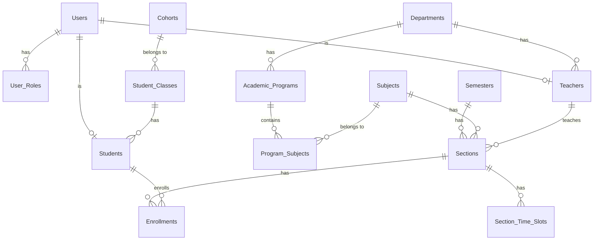

<div align="center">

# 🎓 Student Registration System

### Hệ thống Quản lý Sinh viên Toàn diện

[](https://spring.io/projects/spring-boot)
[](https://vuejs.org/)
[](https://www.java.com/)
[](https://www.postgresql.org/)
[](https://vitejs.dev)

<p align="center">
  
</p>

**Student Registration System ** là một ứng dụng quản lý giáo dục hiện đại, được xây dựng dựa trên kiến trúc **Modular Monolith** sử dụng **Spring Boot** ở Backend và **Vue.js** ở Frontend.

[Tính năng](#-tính-năng) • [Cài đặt](#-cài-đặt) • [Chạy dự án](#-chạy-dự-án) • [Kiến trúc](#-kiến-trúc-hệ-thống) • [Lỗi thường gặp](#-lỗi-thường-gặp) • [Đóng góp](#-đóng-góp)

---

</div>

## 📋 Mục lục

- [Giới thiệu](#-giới-thiệu)
- [Tính năng](#-tính-năng)
- [Công nghệ](#️-công-nghệ-sử-dụng)
- [Kiến trúc hệ thống](#-kiến-trúc-hệ-thống)
- [Yêu cầu hệ thống](#-yêu-cầu-hệ-thống)
- [Cài đặt](#-cài-đặt)
- [Cấu hình](#️-cấu-hình)
- [Chạy dự án](#-chạy-dự-án)
- [Lỗi thường gặp](#-lỗi-thường-gặp)
- [Database Schema](#️-database-schema)
- [Screenshots](#-screenshots)
- [Đóng góp](#-đóng-góp)
- [License](#-license)

---

## 🎯 Giới thiệu

**Student Registration System** là nền tảng quản lý trường học và trung tâm giáo dục, giúp số hóa quy trình quản lý khóa học, sinh viên, giảng viên và kết quả học tập. Dự án theo đuổi kiến trúc Modular Monolith nhằm đảm bảo sự rạch ròi giữa các module nghiệp vụ mà không làm tăng độ phức tạp trong vận hành như Microservices.

### 🌟 Điểm nổi bật

- ⚡ **Hiệu suất cao**: Frontend SPA với Vue.js và Vite
- 🔐 **Bảo mật**: Hệ thống Authentication/Authorization phân quyền chi tiết
- 📦 **Kiến trúc Modular Monolith**: Phân tách logic rõ ràng thành các module độc lập
- 📊 **Quản lý toàn diện**: Xử lý mượt mà dữ liệu sinh viên, khóa học, tài liệu
- 🚀 **Dockerized Infrastructure**: Môi trường chạy các dependencies (Redis, MinIO, RabbitMQ, PostgreSQL) được đóng gói sẵn
- 🔄 **Database Migration**: Quản lý version database chặt chẽ bằng Flyway

---

## ✨ Tính năng

### 👨‍🎓 Sinh viên / Học viên

<details>
<summary><b>Quản lý học thuật</b></summary>

- ✅ Xem danh sách khóa học đang theo học
- ✅ Đăng ký khóa học mới
- ✅ Xem thời khóa biểu cá nhân
- ✅ Theo dõi điểm số và kết quả học tập

</details>


### 👨‍🏫 Giảng viên

<details>
<summary><b>Quản lý lớp học phần</b></summary>

- ✅ Xem danh sách sinh viên trong lớp
- ✅ Nhập điểm sinh viên trong lớp 

</details>

<details>
<summary><b>Quản lý lớp hành chính</b></summary>

- ✅ Quản lý điểm số tổng hợp của lớp

</details>

### 👨‍💼 Admin / Quản lý giáo vụ

<details>
<summary><b>Quản trị hệ thống</b></summary>

- ✅ Quản lý tài khoản (Sinh viên, Giảng viên, Staff)
- ✅ Phân quyền và cấp vai trò hệ thống
- ✅ Quản lý chương trình học (Academic Programs), Môn học (Subjects)
- ✅ Xếp thời khóa biểu và phòng học

</details>

---

## 🛠️ Công nghệ sử dụng

### Backend

```
Java Framework: Spring Boot 3.x
Language: Java 21
ORM: Spring Data JPA, Hibernate
Build Tool: Maven (Maven Wrapper)
Migration: Flyway
```

### Frontend

```
Framework: Vue.js 3.x
Router & State: Vue Router, Vuex
Build Tool: Vite 5.x
```

### Database & Caching & Services

```
RDBMS: PostgreSQL 18
Cache: Redis 7
Message Queue: RabbitMQ 3
Object Storage: MinIO
```

---

## 🏗️ Kiến trúc hệ thống

Dự án được xây dựng theo kiến trúc **Modular Monolith**, gom nhóm các chức năng thành các module bên trong cùng một project. Ưu điểm là phân tách ranh giới logic rõ ràng mà không phải chịu tổn phí quản lý phức tạp như Microservices.

- **`src/main/java/vn/com/nws/cms/modules/`**: Nơi chứa các thư mục module cốt lõi (như `academic`, `auth`...). Mỗi module thiết kế với cấu trúc chuẩn (API, Core/Domain, Infrastructure).
- **`src/main/resources/db/migration/`**: Nơi lưu trữ các version script `.sql` của Flyway phụ trách thiết lập database.
- **`frontend/`**: Chứa toàn bộ giao diện SPA.

```
┌─────────────────────────────────────────────────────────┐
│                    CLIENT LAYER                         │
│  ┌──────────────────────────────────────────────────┐   │
│  │          Vue.js SPA                              │   │
│  │  - Vue Router, Vuex                              │   │
│  │  - UI Components                                 │   │
│  └──────────────────────────────────────────────────┘   │
└─────────────────────────────────────────────────────────┘
                         ▼ HTTP/REST
┌─────────────────────────────────────────────────────────┐
│                  MODULAR BACKEND                        │
│  ┌─────────────────┐ ┌─────────────────┐ ┌──────────┐   │
│  │  Auth Module    │ │ Academic Module │ │   ...    │   │
│  └─────────────────┘ └─────────────────┘ └──────────┘   │
│  (Mỗi module bao gồm API, Domain, Infrastructure)       │
└─────────────────────────────────────────────────────────┘
                         ▼
┌─────────────────────────────────────────────────────────┐
│                 INFRASTRUCTURE LAYER                    │
│  - PostgreSQL (Database chính)                          │
│  - Redis (Caching)                                      │
│  - RabbitMQ (Message Broker)                            │
│  - MinIO (Object Storage)                               │
└─────────────────────────────────────────────────────────┘
```

---

## 💻 Yêu cầu hệ thống

Để có thể chạy được dự án, máy tính của bạn cần cài đặt:

- **Java Development Kit (JDK) 21**
- **Node.js** và **npm**
- **Docker** & **Docker Compose** (để quản lý/chạy external services)
- **PostgreSQL** (đang hoạt động, cổng mặc định 5432, có thể thay thế bằng Docker)

---

## 📦 Cài đặt

### 1. Cài đặt Backend Dependencies

Backend sử dụng Maven Wrapper, các thư viện sẽ tự động cài khi build:
```bash
./mvnw clean compile
```

### 2. Cài đặt Frontend Dependencies

```bash
cd frontend
npm install
```

---

## ⚙️ Cấu hình

### Tạo file Environment

```bash
cp .env.example .env
```

### Chỉnh sửa cấu hình RabbitMQ

Chẳng hạn bạn khởi chạy service thỏ (RabbitMQ) qua Docker với username và password là `guest`, bạn sẽ cần khai báo password đó trong file `.env`:

```env
RABBITMQ_PASSWORD=guest
```

---

## 🚀 Chạy dự án

### 1. Khởi chạy các dịch vụ lưu trữ phụ trợ (Docker)

```bash
# Redis
docker run -d --name redis -p 6379:6379 -v redis-data:/data redis:7 redis-server --appendonly yes

# MinIO
docker run -p 9000:9000 -p 9001:9001 -e "MINIO_ROOT_USER=minioadmin" -e "MINIO_ROOT_PASSWORD=minioadmin" minio/minio server /data --console-address ":9001"

# PostgreSQL (nếu không dùng service cài trên máy tĩnh)
docker run -d --name cms-postgres -e POSTGRES_DB=csm -e POSTGRES_USER=postgres -e POSTGRES_PASSWORD=123456 -p 5432:5432 -v postgres_data:/var/lib/postgresql/data postgres:16-alpine

# RabbitMQ
docker run -d --name rabbitmq -p 5672:5672 -p 15672:15672 -e RABBITMQ_DEFAULT_USER=guest -e RABBITMQ_DEFAULT_PASS=guest rabbitmq:3-management
```

### 2. Cấu hình và Migrate Database (Flyway)

**⚠️ QUAN TRỌNG:** Trước khi chạy Spring Boot, bạn **bắt buộc** phải sử dụng Flyway để tự động phát sinh ra các bảng (tables) và dữ liệu mẫu (seed data) trong Database.

Mở Terminal và thực thi lệnh bên dưới (Lưu ý: đổi tên CSDL, username, pass phù hợp với máy):

```bash
./mvnw "org.flywaydb:flyway-maven-plugin:10.10.0:migrate" \
"-Dflyway.url=jdbc:postgresql://localhost:5432/csm" \
"-Dflyway.user=postgres" \
"-Dflyway.password=123456" \
"-Dflyway.locations=filesystem:src/main/resources/db/migration"
```
*(Đảm bảo database "csm" đã tồn tại sẵn trong PostgreSQL trước khi chạy mã lệnh trên).*

### 3. Khởi chạy Backend Server

```bash
./mvnw spring-boot:run
```
*(Hoặc thưc hiện chạy trực tiếp file Application thông qua Intellij / Eclipse IDE).*
Backend sẽ phục vụ API tại: `http://localhost:8080`

### 4. Khởi chạy Frontend Development Server

Bật Terminal thứ hai:

```bash
cd frontend
npm run dev
```
Frontend sẽ được máy chủ cung cấp dịch vụ tại trang web: `http://localhost:5173`

---

## 🔧 Lỗi thường gặp

### 1. Lỗi trùng cổng 8080 trên Windows
Nếu khởi chạy backend bị phàn nàn `Port 8080 is already in use`, hãy chạy PowerShell (bằng quyền quản trị viên Admin):
```powershell
Get-NetTCPConnection -LocalPort 8080 -ErrorAction SilentlyContinue | 
Select-Object -ExpandProperty OwningProcess | 
ForEach-Object { Stop-Process -Id $_ -Force }
```

### 2. Lỗi Build Backend Dependencies
Trong trường hợp server gặp lỗi build hay dependency, thử dọn dẹp và đóng gói lại:
```bash
./mvnw clean compile
./mvnw clean package
```

---

## 🗄️ Database Schema

### Core Tables

#### 1. Hệ thống & Phân quyền (RBAC)
- `users`: Thông tin truy cập, đăng nhập người dùng
- `roles` & `permissions`: Quản lý vai trò (Admin, Teacher, Student) và các quyền hệ thống
- `user_roles`, `role_permissions`: Bảng trung gian phân quyền
- `auth_audit_events`: Ghi chú lại lịch sử truy cập (Audit)

#### 2. Cấu trúc học vụ chính
- `academic_programs`: Chương trình đào tạo chính
- `subjects`: Danh sách môn học, số tín chỉ
- `program_subjects`: Các môn học thuộc chương trình (cùng điểm chuẩn qua môn)
- `semesters`: Quản lý các học kỳ (start_date, end_date)
- `departments`: Các phòng / ban / khoa nghiệp vụ

#### 3. Cán bộ & Sinh viên
- `teachers`: Thông tin giảng viên (liên kết tới `users` và `departments`)
- `students`: Thông tin sinh viên (liên kết tới `users`, `departments`, `student_classes`)
- `cohorts`: Khóa học (ví dụ: K62, K63)
- `student_classes`: Lớp sinh viên hành chính (chủ nhiệm bởi giảng viên)

#### 4. Học phần & Kết quả học tập
- `sections`: Lớp học phần, liên kết môn học, giảng viên và học kỳ
- `section_time_slots`: Thời gian và địa điểm phòng học cho mỗi lớp học phần
- `enrollments`: Quản lý ghi danh của sinh viên vào lớp học phần. Nơi lưu trữ điểm số (`process_score`, `exam_score`, `final_score`)

### Entity Relationship Diagram (Mạch chính)



---

## 📸 Screenshots

*(Đang cập nhật các hình ảnh minh hoạ...)*

---


## 👨💻 Tác giả

**Kiet**
- GitHub: [@TuanKietHN](https://github.com/TuanKietHN/)
- Email: tuankiethn2410@gmail.com

---

## 📄 License

Dự án này được cấp phép và phân phối dưới các điều khoản của **[GNU General Public License v3.0 (GPL-3.0)](LICENSE)**.

### Tại sao lại là GPL-3.0?

Sử dụng giấy phép mã nguồn mở GPL-3.0 mang lại các quyền lợi và ràng buộc rõ ràng cho cả tác giả và cộng đồng:

**Bạn ĐƯỢC PHÉP (Permissions):**
- ✓ Sử dụng vì mục đích thương mại
- ✓ Thay đổi và tùy chỉnh mã nguồn
- ✓ Phân phối lại phần mềm
- ✓ Hưởng quyền bảo vệ tránh rủi ro về bằng sáng chế
- ✓ Sử dụng nội bộ hoặc cá nhân

**Bạn KHÔNG ĐƯỢC (Limitations):**
- ✗ Yêu cầu tác giả chịu trách nhiệm liên quan đến bảo hành hay thiệt hại
- ✗ Giữ mã nguồn ở dạng đóng (Phần mềm phát sinh phải sử dụng chung giấy phép GPL-3.0)

**Ràng buộc (Conditions):**
- Bắt buộc phải chia sẻ toàn bộ mã nguồn thay đổi và phần mềm phái sinh
- Phải đính kèm bản mô tả các phần đã thay đổi so với bản gốc
- Phải kèm theo file chứa thông tin License và file Copyright

Xem chi tiết trong file [LICENSE](LICENSE) nguyên bản của dự án.

---

<div align="center">

### ⭐ Nếu project hữu ích, hãy cho một star nhé! ⭐

**Made with ❤️ by Kiet**

[⬆ Quay lại trên cùng](#-course-management-system-cms)

</div>
